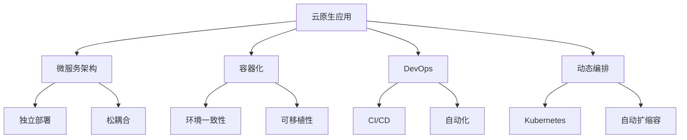
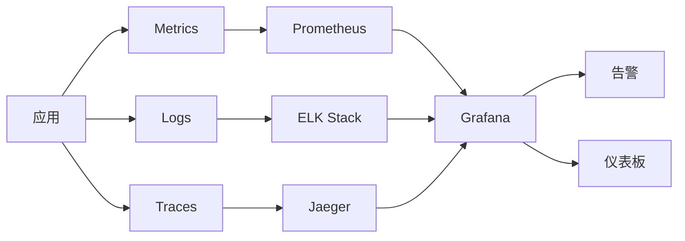
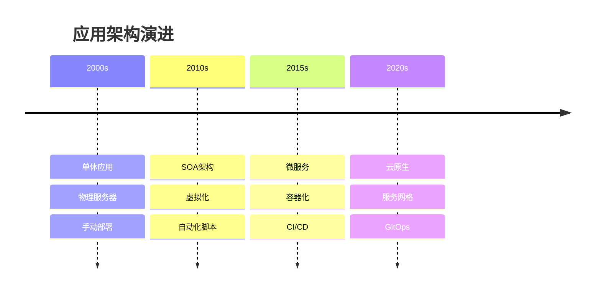
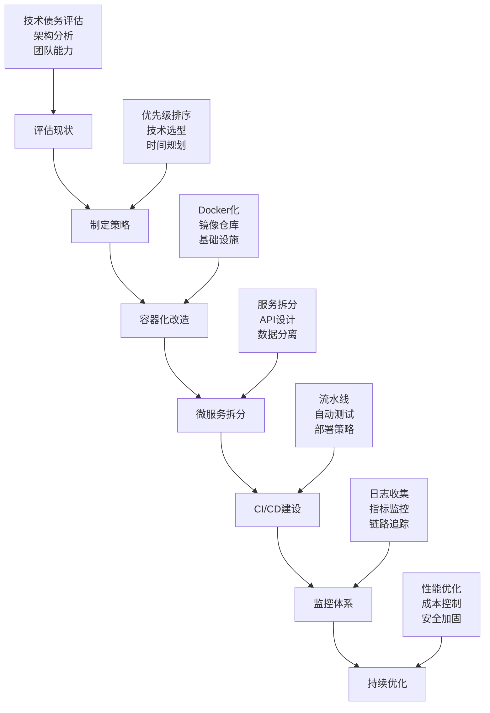

# 云原生技术指南

**作者：** RJ.Wang  
**邮箱：** wangrenjun@gmail.com  
**创建时间：** 2025-11-12

---

## 📖 目录

1. [云原生概念](#云原生概念)
2. [核心特征](#核心特征)
3. [技术架构](#技术架构)
4. [传统vs云原生](#传统vs云原生)
5. [实施路径](#实施路径)
6. [最佳实践](#最佳实践)

---

## 🌟 云原生概念

### 定义
云原生（Cloud Native）是一种构建和运行应用程序的方法，充分利用云计算的优势，让应用程序天生就适合在云环境中运行。



### 四大支柱

#### 1. 🏗️ 微服务架构
- **单一职责**：每个服务专注一个业务功能
- **独立部署**：服务间互不影响
- **技术多样性**：不同服务可用不同技术栈

#### 2. 📦 容器化
- **轻量级**：比虚拟机更高效
- **一致性**：开发、测试、生产环境统一
- **可移植性**：跨平台运行

#### 3. 🔄 DevOps与CI/CD
- **持续集成**：代码自动构建测试
- **持续部署**：自动化发布流程
- **快速反馈**：问题快速定位修复

#### 4. 🎛️ 动态编排
- **自动化管理**：容器生命周期管理
- **弹性伸缩**：根据负载自动调整
- **故障恢复**：自动重启失败服务

---

## 🎯 核心特征

### 技术特征对比表

| 特征 | 传统应用 | 云原生应用 |
|------|---------|-----------|
| **架构模式** | 单体架构 | 微服务架构 |
| **部署方式** | 物理机/虚拟机 | 容器 |
| **扩展方式** | 垂直扩展 | 水平扩展 |
| **故障处理** | 人工干预 | 自动恢复 |
| **更新频率** | 月/季度 | 日/周 |
| **资源利用** | 固定分配 | 动态分配 |

### 云原生优势

```
📈 敏捷性
├── 快速迭代
├── 快速部署
└── 快速响应

🛡️ 可靠性  
├── 故障隔离
├── 自动恢复
└── 高可用性

⚡ 可扩展性
├── 弹性伸缩
├── 负载均衡
└── 资源优化

💰 成本效益
├── 按需付费
├── 资源共享
└── 运维自动化
```

---

## 🏛️ 技术架构

### 云原生技术栈

```
┌─────────────────────────────────────┐
│           应用层                     │
│  Spring Boot │ Node.js │ Go │ .NET  │
├─────────────────────────────────────┤
│           服务网格                   │
│     Istio │ Linkerd │ Consul       │
├─────────────────────────────────────┤
│           容器编排                   │
│   Kubernetes │ Docker Swarm        │
├─────────────────────────────────────┤
│           容器运行时                 │
│    Docker │ Containerd │ CRI-O     │
├─────────────────────────────────────┤
│           基础设施                   │
│   AWS │ Azure │ GCP │ 私有云       │
└─────────────────────────────────────┘
```

### 监控与可观测性



---

## ⚖️ 传统 vs 云原生

### 部署方式对比

#### 传统部署
```bash
# 传统单体应用部署
┌─────────────────┐
│   物理服务器     │
│  ┌───────────┐  │
│  │    OS     │  │
│  │ ┌───────┐ │  │
│  │ │  App  │ │  │
│  │ └───────┘ │  │
│  └───────────┘  │
└─────────────────┘
```

#### 云原生部署
```bash
# 云原生微服务部署
┌─────────────────────────────────┐
│         Kubernetes集群           │
│  ┌─────┐ ┌─────┐ ┌─────┐ ┌─────┐ │
│  │Pod1 │ │Pod2 │ │Pod3 │ │Pod4 │ │
│  │App-A│ │App-B│ │App-C│ │App-D│ │
│  └─────┘ └─────┘ └─────┘ └─────┘ │
└─────────────────────────────────┘
```

### 演进路径



---

## 🛤️ 实施路径

### 云原生转型步骤



### 关键里程碑

| 阶段 | 目标 | 关键指标 |
|------|------|---------|
| **容器化** | 应用容器化 | 容器化率 > 80% |
| **编排** | K8s部署 | 自动化部署率 > 90% |
| **微服务** | 服务拆分 | 服务独立部署率 > 70% |
| **DevOps** | CI/CD | 部署频率 > 1次/天 |
| **监控** | 可观测性 | 故障发现时间 < 5分钟 |

---

## 💡 最佳实践

### 设计原则

#### 1. 🎯 单一职责原则
```yaml
# 好的微服务设计
apiVersion: apps/v1
kind: Deployment
metadata:
  name: user-service
spec:
  replicas: 3
  selector:
    matchLabels:
      app: user-service
  template:
    spec:
      containers:
      - name: user-service
        image: user-service:v1.0
        ports:
        - containerPort: 8080
```

#### 2. 🔒 安全最佳实践
- **最小权限原则**：只给必要的权限
- **镜像安全**：使用官方基础镜像
- **网络隔离**：使用网络策略
- **密钥管理**：使用Secret管理敏感信息

#### 3. 📊 监控策略
```yaml
# Prometheus监控配置示例
apiVersion: v1
kind: ServiceMonitor
metadata:
  name: app-monitor
spec:
  selector:
    matchLabels:
      app: my-app
  endpoints:
  - port: metrics
    interval: 30s
    path: /metrics
```

### 常见陷阱与解决方案

| 陷阱 | 问题 | 解决方案 |
|------|------|---------|
| **过度拆分** | 服务太多难管理 | 按业务边界合理拆分 |
| **数据一致性** | 分布式事务复杂 | 使用事件驱动架构 |
| **网络延迟** | 服务间调用慢 | 合理设计API，使用缓存 |
| **调试困难** | 分布式系统难排查 | 完善日志和链路追踪 |

---

## 🎉 总结

云原生不仅仅是技术的升级，更是思维方式的转变：

### 核心价值
- **从"适应环境"到"为云而生"**
- **从"人工运维"到"自动化运维"**  
- **从"单体应用"到"微服务架构"**
- **从"固定资源"到"弹性资源"**

### 成功关键
1. **渐进式转型**：不要一步到位
2. **团队培训**：提升团队云原生技能
3. **文化变革**：拥抱DevOps文化
4. **持续改进**：基于反馈不断优化

---

**作者：** RJ.Wang  
**邮箱：** wangrenjun@gmail.com  
**文档版本：** v1.0  
**最后更新：** 2025-11-12  
**适用于：** 云原生技术学习与实践
